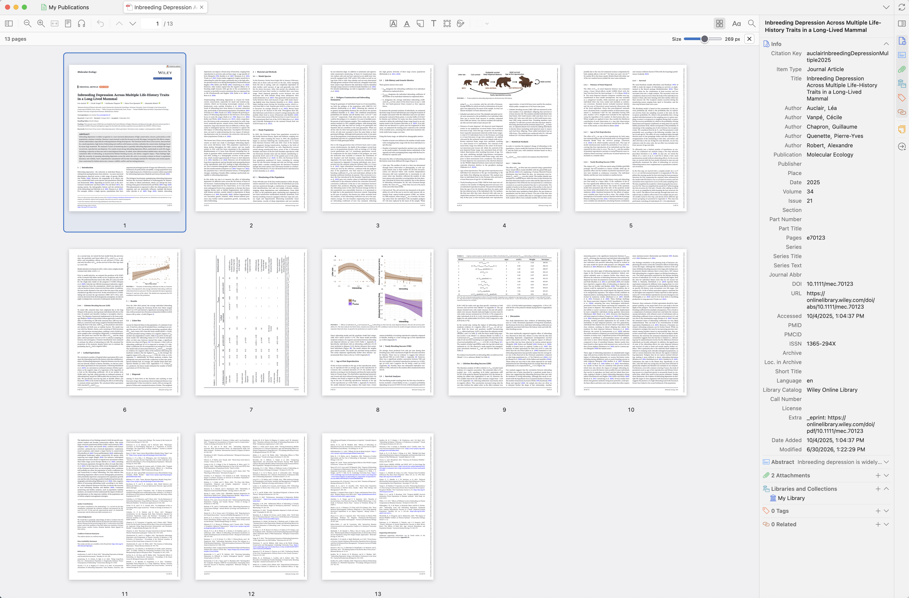

# ZoteroThumbFile

A **Contact Sheet view for PDF tabs in Zotero**, like Contact Sheet in macOS Preview. Browse the whole file as a grid of pages, resize the thumbnails, and scroll to the final page. The grid fills the reader area and also works in separate PDF windows.



Previously named **ZoteroThumbPDF**. Installing ZoteroThumbFile updates the existing plugin and retains its settings; the internal add-on ID is unchanged. This release provides contact sheets for PDF files.

## Install

Built for **Zotero 9.0.x and 10.0.x**. Version 1.1.5 was tested inside **Zotero 10.0.4 for macOS**, using an isolated profile and synthetic PDFs. The unchanged contact-sheet implementation was previously tested inside Zotero 9.0.6 for macOS.

1. Download the `ZoteroThumbFile-1.1.5.xpi` installer from the [latest GitHub release](https://github.com/gchapron/ZoteroThumbFile/releases/latest). Choose the **XPI asset**, not a source-code archive.
2. In Zotero, open **Tools → Plugins**.
3. Choose the gear menu → **Install Plugin From File…**.
4. Select the downloaded XPI.
5. Restart Zotero if prompted.

No developer tools or external PDF renderer are needed to use the installer.

## Use

- Open a PDF to see its contact sheet automatically. Its compact 32-pixel toolbar shows the page count, size control, and close icon without a large title.
- Scroll through all pages. The grid loads nearby thumbnails as needed. Existing previews remain visible during zoom; sharper replacements appear only after they finish decoding.
- Use **Size** to zoom continuously between 100 and 400 pixels, without 10-pixel snapping. You can also use **⌘+**, **⌘−**, and **⌘0** to reset the size.
- Click a page to read it in Zotero's normal reader. Click the page-grid button in the reader toolbar to return to the sheet; your scroll position is retained.
- Use arrow keys, Home, and End to move between pages, and Enter to open the selected page.
- Press Escape or click the **×** close button to return to the reader.
- Uncheck **Tools → Open PDFs in Contact Sheet** to open new PDFs normally and use the toolbar button to enter the sheet manually.

Disabling the plugin removes its grid and controls and restores the normal reader. It does not modify PDF files, annotations, or the underlying sidebar configuration. EPUBs and web snapshots are not affected.

## Rendering and limits

Page images come from the PDF already open in Zotero, using its bundled PDF.js renderer. Portrait and landscape pages retain their aspect ratios. Previews are rendered at up to twice the selected size for high-density displays. Only nearby grid cells are mounted, with at most two rendering jobs and a cache limited to 48 images and approximately 24 MiB of image strings per reader.

Thumbnails show PDF page contents. Zotero's separately stored annotation overlays remain available in the normal reader. Pages that cannot be rendered show a placeholder. This release has been exercised with synthetic PDFs, including an 80-page document; it does not establish compatibility with every PDF encoding, font, damaged file, or scanned document.

The contact sheet has its own browsing context and keyboard handling, so its Delete/Backspace and zoom keys cannot act on selected annotations or zoom the PDF underneath. Tab and Shift-Tab stay among the contact-sheet controls.

## Build and test

All runtime source is at the repository root. Build with Python 3:

```sh
python3 scripts/build.py
```

The script uses only the standard library and writes a reproducible XPI and `SHA256SUMS.txt` to `dist/`. This generated directory is ignored by Git; installers and checksums are published as GitHub release assets. The source, build script, and tests remain tracked.

Run the dependency-free portable tests with Node:

```sh
node --test tests/plugin.test.cjs
```

Thirteen tests cover long-document geometry, last-page reachability, zoom coalescing and debouncing, atomic preview replacement, render concurrency and cancellation, cache bounds, lifecycle cleanup, and early keyboard input.

`tests/rename-package-result.json` records the 1.1.4 rename checks: the runtime code, add-on ID, and preferences match 1.1.3; the new installer has the updated name and version, and all 13 portable tests pass.

`tests/runtime-result.json` preserves the actual Zotero tests from 1.1.3 with an isolated profile and synthetic files. They verified zero blank or undecoded preview frames during rapid zoom, the full 80-page grid, 100–400-pixel zoom, an 800-pixel raster, scrolling and navigation to page 80, preserving the return position, mixed page orientations, keyboard isolation with a selected annotation, manual-opening preference, disable/re-enable, and separate reader windows.

`tests/zotero10-runtime-result.json` records the same comprehensive checks passing for version 1.1.5 inside Zotero 10.0.4, including fractional 237.25-pixel zoom, zero blank zoom frames, navigation to page 80, preservation of selected annotations during Delete/Backspace, separate reader windows, and a clean application restart. `tests/compatibility-zotero10-source.json` records the source-interface and installer checks.

`tests/runtime-reader.js` is the integration-test body used with the disposable development harness. It requires that harness and its synthetic fixtures; it is not an installer and must not be run against a personal library. Runtime checks inspected live DOM, decoded images, and application state. Direct screenshot-based visual inspection was unavailable.

## Publish a release

1. Update the manifest version and installation instructions, then run the portable tests and build above. Check the installer in an isolated Zotero profile when runtime behavior changes.
2. Commit the source and documentation, tag that commit as `v<version>`, and push the commit and tag to GitHub.
3. Create a GitHub release from that tag with release notes. Attach `dist/ZoteroThumbFile-<version>.xpi` and `dist/SHA256SUMS.txt` as assets.

Keep published version tags and assets unchanged. Publish a new version for subsequent changes. GitHub releases provide downloads; they do not enable automatic updates in Zotero.

## Compatibility and maintenance

The plugin uses Zotero reader internals and permits installation on Zotero 9.0.x and 10.0.x. The reader toolbar event, PDF initialization, rendering, navigation, and cleanup contracts were checked against the installed Zotero 10.0.4 source. No change to the contact-sheet implementation was needed. Other major versions and operating systems have not been tested. Existing open PDFs receive the control when the plugin is enabled.

Updates are manual. Zotero requires an HTTPS update URL even for a local plugin, so the manifest uses the reserved `updates.invalid` domain without an update service. Update checks may fail harmlessly.

Source contracts were checked in the installed Zotero app: `chrome/content/zotero/xpcom/reader.js`, `resource/reader/reader.js`, `resource/reader/pdf/build/pdf.mjs`, and `chrome/content/zotero/xpcom/plugins.js`. The plugin uses the official reader toolbar event and private reader/PDF.js access for the grid. ID-based listener cleanup works on both supported major versions and avoids a faulty singular unregister method in Zotero 9.0.6.

References: [Zotero plugin development](https://www.zotero.org/support/dev/client_coding/plugin_development), [reader extension hooks](https://www.zotero.org/support/dev/zotero_7_for_developers), [Zotero source](https://github.com/zotero/zotero), and [reader source](https://github.com/zotero/reader).

License: **AGPL-3.0-or-later**. See [LICENSE](LICENSE).
